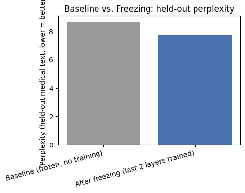
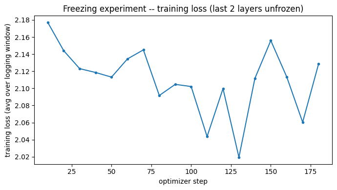
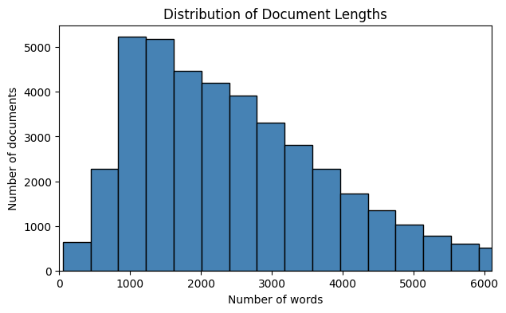
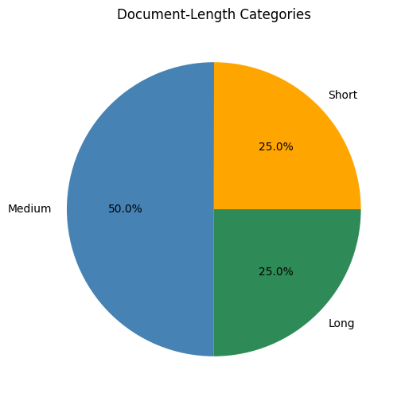
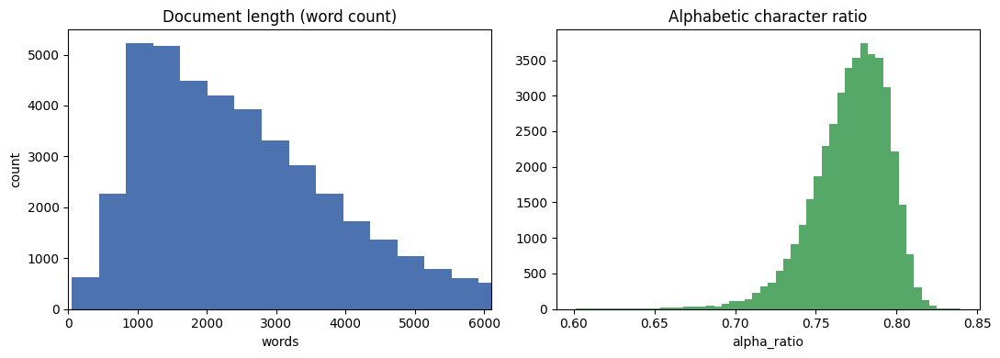
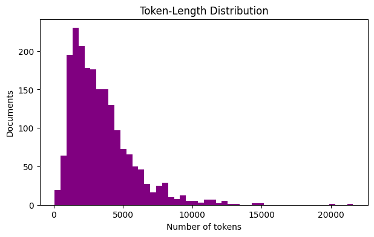
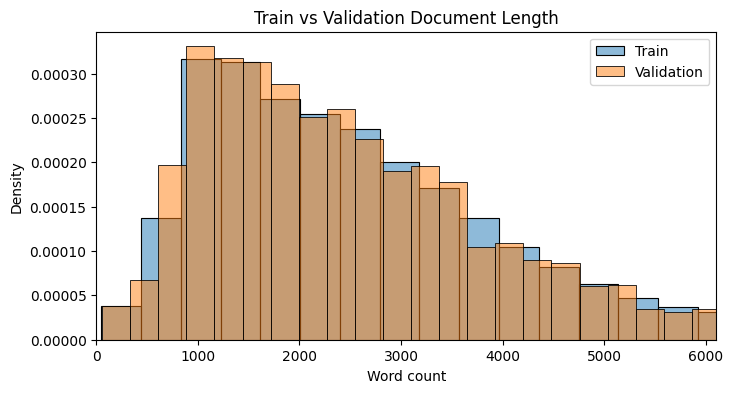
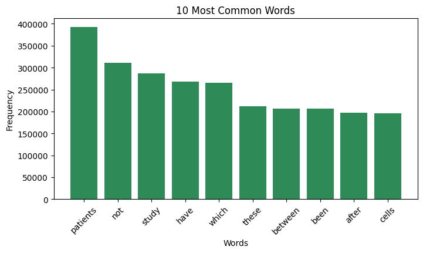
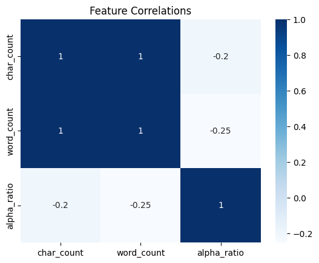

# Freezing

Layer-freezing experiment: domain-adaptive continued pretraining of
[`meta-llama/Llama-3.1-8B-Instruct`](https://huggingface.co/meta-llama/Llama-3.1-8B-Instruct) on
medical text, training only the last few decoder layers while the rest of the pretrained model
stays frozen.

**Author:** Amine · **Notebook:** [`Freezing_experiment.ipynb`](Freezing_experiment.ipynb)

## Method

- **Model:** Llama-3.1-8B-Instruct, loaded in **4-bit** (NF4, bitsandbytes) to fit a free-tier GPU.
- **Trainable:** all layers frozen **except the last 2 decoder layers**, which are kept
  un-quantized (via `llm_int8_skip_modules`) so they can receive gradients — 4-bit weights are
  packed integers and cannot be trained directly. The LM head is also kept un-quantized for
  numerical stability but stays **frozen**.
- **436M of 4.76B parameters are trainable (9.17%).**
- **Dataset:** [`Saminx22/medical_data_for_slm`](https://huggingface.co/datasets/Saminx22/medical_data_for_slm)
  — raw medical text (PubMed abstracts, PMC full text, WHO/CDC/NICE guidelines), used for
  continued pretraining (next-token prediction), not instruction-following.
- **Data:** 1,500 training documents (shuffled, seed 42), 200 validation documents, truncated to
  512 tokens. The median document is ~2,900 tokens, so only the start of each document is seen.
- **Training:** 1 epoch, batch size 1 × gradient accumulation 8 (188 optimizer steps),
  `PagedAdamW8bit`, fp16 + `GradScaler` (the T4 GPU used has no native bf16), gradient
  checkpointing, gradient clipping at 1.0.

## Hyperparameter tuning

Two learning-rate configurations were tried:

| Run | Learning rate | Warmup | Outcome |
|---|---|---|---|
| 1 | 2e-5 | none | Training loss **rose** (1.76 → 2.09) — the optimizer overshot. Not evaluated (its eval cell failed). |
| 2 (final) | 5e-6 | 10% linear | Training loss drifts down, noisily (2.18 → ~2.02–2.13). |

## Results

Held-out validation perplexity (lower is better):

| Stage | Eval loss | Perplexity | Change |
|---|---|---|---|
| Baseline (no training) | 2.1591 | 8.66 | — |
| After freezing (last 2 layers trained) | 2.0518 | 7.78 | **−10.2%** |

**Qualitative check** (same prompt, greedy decoding): before training, the model gives a
generic chatbot-style answer. After training, it produces a clinical-case narrative in the
corpus's own style (lowercase, one sentence per line) — part of the perplexity gain likely
comes from learning the corpus's **style/format**, not only its medical content.

## EDA

## Limitations

- Single run per configuration (one seed).
- Small subset (1,500 train / 200 eval documents out of ~44K available).
- 512-token truncation means most of each document is never seen.
- One epoch only.

## How to run

1. Open the notebook in Google Colab.
2. `Runtime > Change runtime type > T4 GPU`.
3. Accept the Llama-3.1 license on its [Hugging Face page](https://huggingface.co/meta-llama/Llama-3.1-8B-Instruct).
4. Add your Hugging Face token as a **Colab Secret** named `HF_TOKEN` (key icon in the left
   sidebar) — never hardcode a token in the notebook.
5. `Runtime > Run all`.
